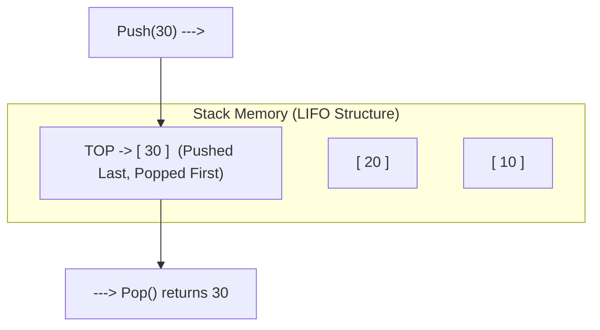
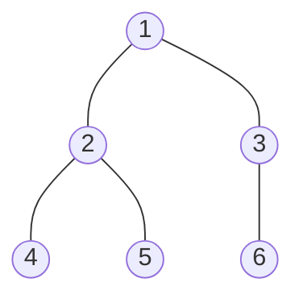

# 📚 Data Structures & Algorithms (DSA) Complete Project Guide

A comprehensive study and reference guide covering core Data Structures & Algorithms concepts implemented in the **Engineering Notes Hub (NW Portal)**.

---

## 📋 Table of Contents
1. [Arrays & Sequential Memory Allocation](#1-arrays--sequential-memory-allocation)
2. [Pointers & Dynamic Memory Management](#2-pointers--dynamic-memory-management)
3. [Stack Data Structure (LIFO)](#3-stack-data-structure-lifo)
4. [Linear Queue vs. Circular Queue](#4-linear-queue-vs-circular-queue)
5. [Double-Ended Queue (Deque)](#5-double-ended-queue-deque)
6. [Singly & Doubly Linked Lists](#6-singly--doubly-linked-lists)
7. [Binary Search Algorithm](#7-binary-search-algorithm)
8. [Sorting Algorithms (Quick, Merge, Bubble Sort)](#8-sorting-algorithms-quick-merge-bubble-sort)
9. [Binary Trees & Binary Search Trees (BST)](#9-binary-trees--binary-search-trees-bst)
10. [Graph Data Structure & Traversals (BFS / DFS)](#10-graph-data-structure--traversals-bfs--dfs)
11. [🎯 How This Project & Guide is Useful for Others](#11--how-this-project--guide-is-useful-for-others)

---

## 1. Arrays & Sequential Memory Allocation

### Q1. What is an Array and how is contiguous memory allocated for 1D and 2D arrays in C++?

#### 1. Explain in Short
An Array is a linear data structure that stores a fixed-size sequential collection of elements of the same data type in contiguous memory locations with $O(1)$ index-based access.

#### 2. Explain in Detail
- **Memory Layout**: When an array `int arr[5]` is declared, the compiler reserves a contiguous block of memory equal to `size * sizeof(datatype)` bytes.
- **Address Calculation Formula**:
  $$\text{Address of } arr[i] = \text{Base Address} + (i \times \text{sizeof(element)})$$
- **2D Array Mapping**:
  - **Row-Major Order** (C++ default): Elements of row 0 are stored first, followed by row 1.
    $$\text{Address of } A[i][j] = \text{Base Address} + [(i \times N) + j] \times \text{sizeof(element)}$$
  - **Column-Major Order**: Elements of column 0 stored first.
- **Operations & Complexities**:
  - Access / Lookup: $O(1)$
  - Search (Unsorted): $O(N)$
  - Insertion / Deletion: $O(N)$ (requires shifting elements)

```cpp
#include <iostream>
using namespace std;

int main() {
    int arr[4] = {10, 20, 30, 40};
    for(int i = 0; i < 4; i++) {
        cout << "Element " << arr[i] << " at Address: " << (arr + i) << endl;
    }
    return 0;
}
```

#### 3. Explain in Visual

```
1D Array Contiguous Memory Representation (Base Address: 0x1000, sizeof(int) = 4 bytes)
+----------------+----------------+----------------+----------------+
|  arr[0] = 10   |  arr[1] = 20   |  arr[2] = 30   |  arr[3] = 40   |
+----------------+----------------+----------------+----------------+
|     0x1000     |     0x1004     |     0x1008     |     0x100C     |
+----------------+----------------+----------------+----------------+
  ^
  |-- Base Address

2D Array Row-Major Mapping (Matrix 2x3):
[ [1, 2, 3], 
  [4, 5, 6] ]

Contiguous Memory Blocks:
+-------+-------+-------+-------+-------+-------+
| (0,0) | (0,1) | (0,2) | (1,0) | (1,1) | (1,2) |
|   1   |   2   |   3   |   4   |   5   |   6   |
+-------+-------+-------+-------+-------+-------+
|0x2000 |0x2004 |0x2008 |0x200C |0x2010 |0x2014 |
+-------+-------+-------+-------+-------+-------+
```

---

## 2. Pointers & Dynamic Memory Management

### Q2. How does Dynamic Memory Allocation (`new` / `delete`) differ from Static Allocation?

#### 1. Explain in Short
Static memory allocation reserves fixed memory on the Stack at compile time, whereas Dynamic memory allocation allocates flexible memory on the Heap at runtime using pointers via `new` and `delete`.

#### 2. Explain in Detail
- **Stack vs Heap**:
  - **Stack**: Fast access, fixed size determined at compile time, automatic deallocation when scope ends.
  - **Heap**: Dynamic size, manually managed using pointers. Must be explicitly deallocated using `delete` / `delete[]` to prevent **Memory Leaks**.
- **Dangling Pointers**: Occur when memory pointed to by a pointer is deleted, but pointer is not reset to `nullptr`.

```cpp
#include <iostream>
using namespace std;

int main() {
    // Dynamic Array Allocation on Heap
    int size = 5;
    int* ptr = new int[size];

    for(int i = 0; i < size; i++) ptr[i] = (i + 1) * 10;

    cout << "Dynamic Value at index 2: " << ptr[2] << endl;

    // Deallocate Memory to prevent Memory Leak
    delete[] ptr;
    ptr = nullptr; // Avoid dangling pointer
    return 0;
}
```

#### 3. Explain in Visual

```
Stack & Heap Memory Division:

+---------------------------------------+
|             STACK MEMORY              |
|  int* ptr  ------[Stores 0x8000]-----+|
+--------------------|------------------+
                     | Pointer Reference
                     v
+---------------------------------------+
|             HEAP MEMORY               |
|  0x8000: [ 10 | 20 | 30 | 40 | 50 ]   |
|  Allocated via: new int[5]            |
+---------------------------------------+
```

---

## 3. Stack Data Structure (LIFO)

### Q3. Explain the Stack Data Structure, LIFO Principle, and Push/Pop Operations.

#### 1. Explain in Short
A Stack is a restricted linear data structure that follows the **Last-In, First-Out (LIFO)** principle, where insertions and deletions happen exclusively at one end called the `Top`.

#### 2. Explain in Detail
- **Core Operations**:
  - `Push(x)`: Inserts element $x$ at `Top`. Checks for **Overflow** if `top == MAX - 1`. Time: $O(1)$.
  - `Pop()`: Removes the topmost element. Checks for **Underflow** if `top == -1`. Time: $O(1)$.
  - `Peek()` / `Top()`: Returns top element without removal. Time: $O(1)$.
- **Applications**: Expression conversion (Infix to Postfix), Function Call Stack (Recursion), Undo/Redo operations in editors.

```cpp
#include <iostream>
#define MAX 100
using namespace std;

class Stack {
    int top;
    int arr[MAX];
public:
    Stack() { top = -1; }
    
    bool push(int val) {
        if (top >= MAX - 1) { cout << "Stack Overflow\n"; return false; }
        arr[++top] = val;
        return true;
    }
    
    int pop() {
        if (top < 0) { cout << "Stack Underflow\n"; return -1; }
        return arr[top--];
    }
};
```

#### 3. Explain in Visual



---

## 4. Linear Queue vs. Circular Queue

### Q4. Why does a Circular Queue solve the false overflow limitation of a Linear Queue?

#### 1. Explain in Short
A Linear Queue causes false overflow when `rear` reaches capacity even if front spaces are vacant after deallocations, whereas a Circular Queue connects the last position back to the first using modulo arithmetic `(rear + 1) % MAX`.

#### 2. Explain in Detail
- **Linear Queue Problem**: When elements are dequeued, `front` advances forward. Once `rear == MAX - 1`, no new elements can be enqueued even if indices `0` to `front - 1` are free.
- **Circular Queue Solution**:
  - `Enqueue`: `rear = (rear + 1) % MAX`
  - `Dequeue`: `front = (front + 1) % MAX`
  - `Full Condition`: `(rear + 1) % MAX == front`
  - `Empty Condition`: `front == -1`

```cpp
#include <iostream>
#define SIZE 5
using namespace std;

class CircularQueue {
    int items[SIZE], front, rear;
public:
    CircularQueue() { front = -1; rear = -1; }

    bool isFull() { return (rear + 1) % SIZE == front; }
    bool isEmpty() { return front == -1; }

    void enqueue(int element) {
        if (isFull()) { cout << "Queue Full!\n"; return; }
        if (isEmpty()) front = 0;
        rear = (rear + 1) % SIZE;
        items[rear] = element;
    }
};
```

#### 3. Explain in Visual

```
Linear Queue (False Overflow State):
Index:   0       1       2       3       4
       [ X ]   [ X ]   [ 30 ]  [ 40 ]  [ 50 ]
                         ^               ^
                       FRONT           REAR (Cannot insert 60!)

Circular Queue Ring Buffer Representation:
               [0: Free]
             /           \
   [4: 50]                  [1: Free]  <-- Rear wraps around to 0!
     (REAR)                
             \           /
               [2: 30] (FRONT)
```

---

## 5. Double-Ended Queue (Deque)

### Q5. What is a Deque and how do Input-Restricted and Output-Restricted Deques operate?

#### 1. Explain in Short
A Deque (Double-Ended Queue) is a generalized queue where insertion and deletion operations can be performed at both the `Front` and `Rear` ends in $O(1)$ time.

#### 2. Explain in Detail
- **Variants**:
  1. **Input-Restricted Deque**: Insertion allowed at `Rear` only; deletion allowed at both `Front` and `Rear`.
  2. **Output-Restricted Deque**: Deletion allowed at `Front` only; insertion allowed at both `Front` and `Rear`.
- **Operations**: `push_front()`, `push_back()`, `pop_front()`, `pop_back()`.

#### 3. Explain in Visual

```
          +--------------------------------------------+
push_front|  [Front]   [Element]   [Element]  [Rear]   |push_back
=========>|                                            |<=========
pop_front |  <-------------------------------------->  |pop_back
<=========|                                            |=========>
          +--------------------------------------------+
```

---

## 6. Singly & Doubly Linked Lists

### Q6. Differentiate between Static Arrays and Dynamic Linked Lists.

#### 1. Explain in Short
Arrays use fixed contiguous memory blocks with $O(1)$ direct index access, whereas Linked Lists use dynamic non-contiguous heap nodes linked via pointers, enabling $O(1)$ insertions/deletions without element shifting.

#### 2. Explain in Detail

| Metric | Array | Linked List |
| :--- | :--- | :--- |
| **Memory Allocation** | Contiguous (Stack/Heap) | Non-Contiguous (Heap) |
| **Size** | Fixed at declaration | Dynamic (Grows/Shrinks) |
| **Access Time** | $O(1)$ Direct Indexing | $O(N)$ Sequential Traversal |
| **Insertion / Deletion** | $O(N)$ Due to element shifts | $O(1)$ Node Pointer Re-linking |
| **Memory Overhead** | Low (data only) | Higher (data + pointer node space) |

```cpp
struct Node {
    int data;
    Node* next;
    Node(int val) : data(val), next(nullptr) {}
};
```

#### 3. Explain in Visual

```
Singly Linked List Memory Traversal:

HEAD
[0x1000]
   |
   v
+--------+--------+      +--------+--------+      +--------+--------+
| Data:10|Next:0x2000|-> | Data:20|Next:0x3000|-> | Data:30|Next:NULL|
+--------+--------+      +--------+--------+      +--------+--------+
 Address: 0x1000          Address: 0x2000          Address: 0x3000
```

---

## 7. Binary Search Algorithm

### Q7. Explain Binary Search, its Divide-and-Conquer strategy, and why the input must be sorted.

#### 1. Explain in Short
Binary Search is an efficient $O(\log N)$ searching algorithm that works on sorted arrays by repeatedly dividing the search interval in half.

#### 2. Explain in Detail
- **Precondition**: Array MUST be sorted.
- **Algorithm Steps**:
  1. Calculate `mid = low + (high - low) / 2`.
  2. If `arr[mid] == target`, return `mid`.
  3. If `target < arr[mid]`, search left half (`high = mid - 1`).
  4. If `target > arr[mid]`, search right half (`low = mid + 1`).
- **Time Complexity**: Worst Case $O(\log_2 N)$, Best Case $O(1)$.

```cpp
int binarySearch(int arr[], int n, int target) {
    int low = 0, high = n - 1;
    while(low <= high) {
        int mid = low + (high - low) / 2;
        if(arr[mid] == target) return mid;
        if(arr[mid] < target) low = mid + 1;
        else high = mid - 1;
    }
    return -1;
}
```

#### 3. Explain in Visual

```
Target: 23 | Array: [2, 5, 8, 12, 16, 23, 38, 56, 72, 91]
Low = 0, High = 9

Step 1: Mid = (0+9)/2 = 4 (Value: 16)
[2, 5, 8, 12, 16] | 23 > 16 -> Search Right Half!

Step 2: Low = 5, High = 9 -> Mid = (5+9)/2 = 7 (Value: 56)
[23, 38, 56, 72, 91] | 23 < 56 -> Search Left Half!

Step 3: Low = 5, High = 6 -> Mid = 5 (Value: 23) -> Found at Index 5!
```

---

## 8. Sorting Algorithms (Quick, Merge, Bubble Sort)

### Q8. Compare Quick Sort, Merge Sort, and Bubble Sort in terms of Time and Space Complexities.

#### 1. Explain in Short
Bubble Sort is a simple $O(N^2)$ comparison sort, Merge Sort is a stable $O(N \log N)$ divide-and-conquer algorithm requiring $O(N)$ extra space, and Quick Sort is an efficient $O(N \log N)$ average in-place partitioning sort.

#### 2. Explain in Detail

| Algorithm | Best Time | Average Time | Worst Time | Space Complexity | Stability |
| :--- | :--- | :--- | :--- | :--- | :--- |
| **Bubble Sort** | $O(N)$ | $O(N^2)$ | $O(N^2)$ | $O(1)$ | Stable |
| **Quick Sort** | $O(N \log N)$ | $O(N \log N)$ | $O(N^2)$ | $O(\log N)$ | Unstable |
| **Merge Sort** | $O(N \log N)$ | $O(N \log N)$ | $O(N \log N)$ | $O(N)$ | Stable |

#### 3. Explain in Visual

```
Merge Sort Divide & Conquer Tree:

               [38, 27, 43, 3, 9, 82, 10]
                      /          \
            [38, 27, 43]        [3, 9, 82, 10]
             /       \            /         \
         [38]      [27, 43]    [3, 9]     [82, 10]
                    /    \      /   \      /     \
                  [27]  [43]  [3]   [9]  [82]   [10]
------------------- MERGE (SORT & COMBINE) -------------------
               [3, 9, 10, 27, 38, 43, 82]
```

---

## 9. Binary Trees & Binary Search Trees (BST)

### Q9. What is a Binary Search Tree (BST) and how do Inorder, Preorder, and Postorder traversals work?

#### 1. Explain in Short
A Binary Search Tree (BST) is a node-based binary tree where every node's left subtree contains values strictly smaller and right subtree contains values strictly greater. Inorder traversal of a BST yields elements in sorted order.

#### 2. Explain in Detail
- **BST Property**: $\text{Left Subtree} < \text{Root} < \text{Right Subtree}$
- **Traversals**:
  - **Preorder (N-L-R)**: Visit Node, Left, Right.
  - **Inorder (L-N-R)**: Visit Left, Node, Right (Produces sorted sequence).
  - **Postorder (L-R-N)**: Visit Left, Right, Node (Used in expression tree deletion).

```cpp
struct TreeNode {
    int val;
    TreeNode* left;
    TreeNode* right;
    TreeNode(int x) : val(x), left(nullptr), right(nullptr) {}
};
```

#### 3. Explain in Visual

```
Binary Search Tree Structure:

         50
       /    \
     30      70
    /  \    /  \
   20  40  60  80

Traversals:
- Preorder  (Root-Left-Right): 50, 30, 20, 40, 70, 60, 80
- Inorder   (Left-Root-Right): 20, 30, 40, 50, 60, 70, 80  <-- Sorted Output!
- Postorder (Left-Right-Root): 20, 40, 30, 60, 80, 70, 50
```

---

## 10. Graph Data Structure & Traversals (BFS / DFS)

### Q10. Explain Breadth-First Search (BFS) vs Depth-First Search (DFS) in Graphs.

#### 1. Explain in Short
BFS explores a graph level-by-level using a Queue data structure, while DFS explores as deep as possible along each branch using a Stack or Recursion.

#### 2. Explain in Detail
- **BFS (Queue-Based)**: Finds shortest path in unweighted graphs. Time: $O(V + E)$, Space: $O(V)$.
- **DFS (Stack/Recursive)**: Used for cycle detection, topological sorting, and pathfinding. Time: $O(V + E)$, Space: $O(V)$.

#### 3. Explain in Visual



---

## 11. 🎯 How This Project & Guide is Useful for Others

### 1. For Engineering Students & Exam Preparation
- **Unit-Wise Syllabus Mapping**: All concepts (Arrays, Stacks, Queues, Sorting, Trees, Graphs) are mapped directly to University Engineering Semester 2 curriculum (DSA, OOP, OS, COA, MATH).
- **Dual Visual & Code Learning**: Every concept includes a short 2-sentence summary, in-depth technical analysis with C++ code, and ASCII / Mermaid visual memory maps for effortless revision before university exams.
- **Model Answer Keys**: Assignments and Question Banks contain side-by-side questions and official model answer solutions.

### 2. For Faculty, Tutors & Academic Administrators
- **Seamless Cloud Uploads**: Faculty can upload question papers and solution PDFs directly via the Admin Upload Portal without needing technical database setup.
- **Persistent Cloud State**: Any uploaded assignment, custom unit, or solution is instantly synchronized across all student devices via Supabase cloud storage.
- **Zero Installation**: Runs 100% in browser on GitHub Pages without requiring local server setups for students.

### 3. For Peer Developers & Technical Reviewers
- **Modular Hybrid Architecture**: Serves as a reference implementation combining client-side Single Page Applications (SPA), Supabase Backend-as-a-Service (PostgreSQL + S3 Storage), and an optional Node.js/Express REST backend.
- **Clean Code & Security Standards**: Features strict 8-character username validation, bcrypt password hashing, Row Level Security (RLS) policies, and responsive CSS token design systems.
