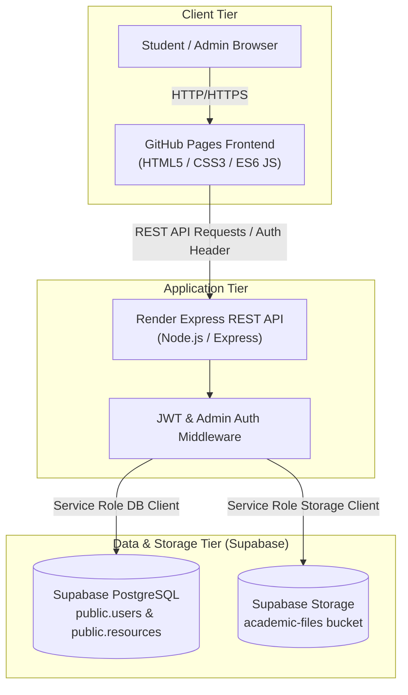

# Engineering Notes Hub

[](https://todkarrohit.github.io/NW/)
[](https://nw-o9m7.onrender.com/api/health)
[](https://supabase.com)
[](#18-project-status)

A comprehensive, full-stack academic web platform built for engineering students to centralize, view, download, and manage academic resources such as unit-wise lecture notes, question banks, and model answer solutions.

---

## 1. Project Overview

**Engineering Notes Hub** is a web-based academic resource repository designed specifically for engineering students and educators. The platform provides a centralized hub for accessing organized, subject-wise, and unit-wise study materials.

Developed with a clean separation of concerns, the application pairs a responsive HTML5/CSS3/JS frontend hosted on **GitHub Pages** with a secure Node.js/Express REST backend hosted on **Render**, backed by **Supabase PostgreSQL** for data persistence and **Supabase Storage** for academic PDF documents.

---

## 2. Problem Statement

Engineering students routinely face major challenges when attempting to prepare for coursework and semester examinations:

- **Fragmented Materials**: Academic resources (study notes, past question papers, assignment solutions) are dispersed across messaging apps, email threads, and personal cloud drives.
- **Inconsistent Access**: Students lack a single, structured portal to quickly locate specific units or chapters for individual subjects.
- **Unregulated Uploads**: Academic documents shared informally often lack verification, leading to outdated or missing content.
- **Poor Mobile Experience**: Standard file directories are difficult to navigate on mobile devices, preventing quick revision on the go.

**Engineering Notes Hub** solves these problems by delivering a unified, organized, mobile-friendly platform where verified resources are published by administrators and made instantly accessible to students on any device.

---

## 3. Objectives

The primary engineering objectives of this project are:

- **Centralized Academic Resources**: Consolidate study notes, question banks, and assignment model answers into a single structured portal.
- **Easy Student Access**: Enable quick navigation across subjects, units, and document types without unnecessary user friction.
- **Admin-Controlled Content Management**: Provide protected administrative workflows for uploading, editing, publishing, and deleting academic files.
- **Secure Authentication & Authorization**: Protect application write endpoints using JSON Web Tokens (JWT) and database-driven role checks (`is_admin`).
- **Mobile Accessibility**: Deliver an adaptive, responsive interface optimized for desktop, tablet, and mobile displays.
- **Synchronized Academic Data**: Maintain real-time data synchronization across all connected clients via a centralized REST API backend.

---

## 4. Key Features

The platform provides the following working features:

| Category | Feature Description |
| :--- | :--- |
| **Student Access** | Read-only browsing of all published study notes, question banks, and model answers. |
| **Student Authentication** | Secure user registration and login with encrypted password storage. |
| **Admin Authorization** | Elevated controls unlocked automatically when `is_admin` is set to `true` in the database. |
| **Question Bank Module** | Unit-wise question papers organized by course and chapter. |
| **Notes Module** | Chapter-wise study notes viewer with inline PDF reading capability. |
| **Subject Management** | Dynamic filtering by academic subjects (e.g., DSA, OOP, OS, MATH, COA). |
| **Unit-Wise Resources** | Clear breakdown of content into standardized academic units (Unit 1 to Unit 5). |
| **PDF Upload & Storage** | Admin dual-PDF upload engine (up to 25 MB) backing files directly to Supabase Storage. |
| **Inline PDF Viewing** | Custom embedded viewer supporting in-browser PDF rendering without forced downloads. |
| **PDF Downloading** | Direct download links for local offline study. |
| **Publish State Control** | Admin toggle to draft or publish resources before making them visible to students. |
| **Mobile Responsive UI** | Custom CSS layout with responsive navigation and touch-friendly modal interfaces. |
| **Multi-Device Sync** | Real-time REST API synchronization ensuring instant updates across student devices. |

---

## 5. Technology Stack

### Frontend
- **HTML5**: Semantic document markup and accessible UI components.
- **CSS3**: Custom CSS design system using CSS variables, Flexbox, Grid, and Glassmorphism aesthetics.
- **JavaScript (ES6+)**: Vanilla client-side script for dynamic DOM rendering, async API calls (`fetch`), and modal state management.

### Backend
- **Node.js**: JavaScript runtime environment.
- **Express.js**: Web server framework for handling RESTful API requests, CORS, and middleware.

### Database & Storage
- **Supabase PostgreSQL**: Relational database storing user profiles, resource metadata, and subject catalogs.
- **Supabase Storage**: S3-compliant object storage bucket (`academic-files`) storing binary PDF assets.

### Deployment & Hosting
- **GitHub Pages**: Static web hosting for client applications.
- **Render**: Deployed web service running the Node.js/Express backend API.

### Authentication & Security
- **Custom App Auth**: User credentials verification against Supabase `public.users`.
- **JWT (JSON Web Tokens)**: Stateless token-based session handling.
- **SHA-256 / Password Hashing**: Secure client and server password digestion.

---

## 6. System Architecture

The following diagram illustrates the flow of data across the client, backend server, database, and object storage:



> [!IMPORTANT]
> **Security Architecture Rule**: All sensitive backend database and storage operations use the server-side `SUPABASE_SERVICE_ROLE_KEY`. This key resides exclusively within the Render environment variables and is **never** exposed to the frontend browser application.

---

## 7. Authentication & Security

The platform adheres to robust web security practices:

- **Custom Users Table**: User accounts are stored in `public.users` in Supabase PostgreSQL.
- **Password Verification**: Passwords are hashed and verified prior to issuing access tokens.
- **JWT Authentication**: Authenticated requests carry a Bearer JWT in the `Authorization` header.
- **Admin Authorization (`is_admin`)**: Write operations (`POST`, `PUT`, `DELETE`, `PATCH`) require `is_admin = true` on the verified user account.
- **Read-Only Access for Normal Users**: Students can read published resources but cannot execute any administrative write operations.
- **Backend-Only Service Role Key**: Privileged Supabase actions are restricted to the server environment.
- **Strict CORS Policy**: API endpoints restrict cross-origin access exclusively to the official frontend origin.
- **File Upload Limits**: PDF uploads are capped at 25 MB to prevent denial-of-service storage saturation.
- **Storage Write Protection**: Supabase Storage buckets are write-protected; direct browser mutation without backend authentication is prohibited.

---

## 8. Admin Workflow

1. **Account Registration**: An administrator registers a standard user account through the platform interface.
2. **Database Promotion**: Admin status is assigned securely in the database by setting `is_admin = true` on the user record in `public.users`.
3. **Standard Login**: The admin logs in through the primary user login modal.
4. **Role Activation**: Upon authentication, the backend returns `is_admin: true` in the user payload and JWT token.
5. **UI Elevation**: The frontend automatically unlocks admin-only features (Upload buttons, Edit triggers, Delete buttons, Publish toggles).
6. **Resource Management**: The admin uploads PDFs or manages academic resources.
7. **Read-Only Isolation**: Regular students remain restricted to read-only resource access.

> [!NOTE]
> There is no separate admin login page or hardcoded admin password. Admin privileges are determined dynamically and securely via database role flags.

---

## 9. Student Workflow

1. **Access Portal**: Student opens the GitHub Pages portal.
2. **Registration / Login**: Student registers or logs into their account (or browses published content).
3. **Select Subject**: Student selects an academic subject (e.g., Data Structures & Algorithms).
4. **Filter by Unit**: Student picks the relevant study unit (e.g., Unit 1 or Unit 2).
5. **Open Document**: Student clicks on Notes, Question Banks, or Model Answers.
6. **View & Download**: Student previews the document inline in the browser viewer or clicks Download for offline viewing.
7. **Restricted Actions**: Any attempt by a regular student to send write requests directly to the API is rejected with `403 Forbidden`.

---

## 10. API / Backend Routes

The Render Express backend (`https://nw-o9m7.onrender.com`) exposes the following core endpoints:

### Authentication Endpoints
- `POST /api/users/register` — Register a new student account.
- `POST /api/users/login` — Authenticate credentials and receive a JWT.
- `GET /api/users/me` — Retrieve current authenticated user profile.

### Health Endpoint
- `GET /api/health` — Returns system status, uptime, and database connectivity.

### Academic Resource Endpoints
- `GET /api/resources` — Retrieve published academic resources (supports `subject`, `unit`, `type` query filters).
- `POST /api/resources` — Admin-only endpoint for uploading dual PDFs and creating resource metadata.
- `PUT /api/resources/:id` — Admin-only endpoint for updating existing resource details.
- `DELETE /api/resources/:id` — Admin-only endpoint for deleting resources and associated storage files.
- `PATCH /api/resources/:id/publish` — Admin-only endpoint to toggle publish/draft status.

### Subject Catalog Endpoints
- `GET /api/resources/subjects` — Fetch list of available subjects and unit metadata.

---

## 11. Supabase Integration

- **PostgreSQL Database**: Serves as the primary data store for user credentials, role assignments, subjects, and resource metadata.
- **Supabase Storage (`academic-files`)**: Houses uploaded academic PDF files securely.
- **Privileged Server Mutations**: The Express backend uses `supabaseAdmin` initialized with `SUPABASE_SERVICE_ROLE_KEY` to execute uploads and deletes safely.
- **Zero Client Key Exposure**: The browser application never receives or stores the service-role key.

---

## 12. Deployment

### Live Applications

- **Frontend Portal**: [https://todkarrohit.github.io/NW](https://todkarrohit.github.io/NW)
- **Backend API**: [https://nw-o9m7.onrender.com](https://nw-o9m7.onrender.com)
- **Backend Health Check**: [https://nw-o9m7.onrender.com/api/health](https://nw-o9m7.onrender.com/api/health)

### Environment Variables Configuration (Render)

When deploying the Express backend on Render, configure the following environment variables:

| Variable Name | Purpose | Example / Format |
| :--- | :--- | :--- |
| `PORT` | Web server port (assigned automatically by Render) | `10000` |
| `SUPABASE_URL` | Unique Supabase project URL | `https://your-project.supabase.co` |
| `SUPABASE_SERVICE_ROLE_KEY` | Privileged Supabase service role secret | `your-supabase-service-role-key` |
| `JWT_SECRET` | Secret key used for signing JWT auth tokens | `your-secure-jwt-secret-key` |
| `ALLOWED_ORIGIN` | Authorized CORS origin for frontend requests | `https://todkarrohit.github.io` |

---

## 13. Local Development

### Prerequisites
- **Node.js**: v20.x or higher
- **npm**: v9.x or higher
- **Git**

### Installation

1. **Clone the repository**:
   ```bash
   git clone https://github.com/TodkarRohit/NW.git
   cd NW
   ```

2. **Setup and run the backend**:
   ```bash
   cd server
   npm install
   ```

3. **Configure Environment Variables**:
   Create a `.env` file inside the `server/` directory based on `.env.example`:
   ```env
   PORT=5000
   SUPABASE_URL=https://your-project.supabase.co
   SUPABASE_SERVICE_ROLE_KEY=your-supabase-service-role-key
   JWT_SECRET=your-jwt-secret
   ALLOWED_ORIGIN=http://localhost:5500
   ```

4. **Start the backend server**:
   ```bash
   npm start
   ```
   The backend will start at `http://localhost:5000`.

5. **Run the Frontend**:
   Open `login/index.html` in your browser or run a simple local web server from the project root:
   ```bash
   npx serve .
   ```

---

## 14. Project Structure

```
NW/
├── assets/
│   ├── auth-modal.js           # Admin login & modal state management
│   ├── auth.js                 # Authentication client & token handler
│   ├── data.js                 # Course syllabus & subject metadata
│   ├── loading-content.js      # Skeletal loaders & UI feedback
│   └── styles.css              # Global design tokens & visual theme
├── assignments/
│   ├── assignments.css         # Assignment layout & modal styles
│   ├── assignments.html        # Assignments portal interface
│   └── assignments.js          # Dual PDF upload & filter interactions
├── login/
│   ├── index.html              # Main student entrance & subject directory
│   └── script.js               # Landing page logic & search engine
├── notes/
│   ├── viewer.css              # Notes viewer styling
│   ├── viewer.html             # Split-panel study notes viewer
│   └── viewer.js               # Notes chapter navigation & PDF embedder
├── question_bank/
│   ├── viewer.css              # Question bank styling
│   ├── viewer.html             # Question bank viewer interface
│   └── viewer.js               # Question bank unit navigator
├── server/
│   ├── config/
│   │   └── supabaseAdmin.js    # Supabase service role initialization
│   ├── controllers/
│   │   └── authController.js   # User registration & authentication logic
│   ├── middleware/
│   │   ├── authMiddleware.js   # JWT & admin role verification
│   │   ├── errorMiddleware.js  # Global error handler
│   │   └── validationMiddleware.js # Input sanitization
│   ├── routes/
│   │   ├── assignmentRoutes.js # Resource & PDF upload routes
│   │   ├── authRoutes.js       # Auth API endpoints
│   │   └── subjectRoutes.js    # Subject catalog routes
│   ├── package.json            # Backend dependencies & startup scripts
│   ├── server.js               # Express application entry point
│   ├── test_isolated_verifications.js
│   ├── test_security_verification.js
│   └── test_suite.js           # Automated backend test suite
├── index.html                  # Root entrance redirect
├── SRS_DOCUMENT.md             # IEEE Software Requirements Specification
├── setup_assignments_db.sql    # Database schema script
├── setup_storage.sql           # Storage policy configuration
└── README.md                   # Project documentation
```

---

## 15. Security Verification

The production architecture underwent a comprehensive Stage 13 security audit covering 11 critical verification vectors:

- **Authentication Integrity**: Token signature and expiration verified on all protected requests.
- **Admin Authorization Enforcement**: Non-admin write operations strictly blocked with HTTP 403.
- **Normal User Write Protection**: Student accounts verified to have zero write or delete privileges.
- **PDF Upload Security**: File type validation and 25 MB payload limits verified.
- **Service-Role Key Protection**: Confirmed absent from all client-side bundles and repos.
- **JWT Security**: Signed tokens validated with secret key verification.
- **CORS Restriction**: Headers restricted strictly to the GitHub Pages production origin.
- **Legacy Removal**: Complete eradication of legacy unauthenticated database endpoints.
- **Admin Promotion Protection**: `is_admin` flag updates protected from client-side tampering.
- **Storage Write Protection**: Supabase Storage bucket write access restricted to backend service-role.
- **Secret Scanning**: Zero hardcoded private keys or tokens found in codebase.

---

## 16. Production Testing

The system completed Stage 14 production testing with a **100% Pass Rate** across 37 test cases:

| Test Suite | Test Area | Result |
| :--- | :--- | :---: |
| **Test 01** | Admin Login Flow | **PASS** |
| **Test 02** | Normal User Login Flow | **PASS** |
| **Test 03** | Question Bank Navigation | **PASS** |
| **Test 04** | Notes Viewer & Rendering | **PASS** |
| **Test 05** | Dual PDF Upload Engine | **PASS** |
| **Test 06** | Inline PDF Viewing & Downloading | **PASS** |
| **Test 07** | Resource Publish State Toggle | **PASS** |
| **Test 08** | Subject Management Catalog | **PASS** |
| **Test 09** | User Session Logout | **PASS** |
| **Test 10** | Mobile Responsive Layout & Modals | **PASS** |
| **Test 11** | Multi-Device Data Sync | **PASS** |
| **Test 12** | API Health Endpoint (`/api/health`) | **PASS** |
| **Test 13** | Backend RBAC Authorization | **PASS** |
| **Test 14** | Browser Network & Console Cleanliness | **PASS** |

---

## 17. Future Enhancements

The following features are planned for future iterations of the platform:

- **Resource Analytics Dashboard**: Visual statistics for document views, downloads, and popular topics.
- **Automated PDF Thumbnail Generation**: Automatic rendering of PDF cover page previews.
- **Multi-College Departmental Support**: Expanding role-based access control to support multiple academic departments.

---

## 18. Project Status

- **Status**: **Production Ready**
- **Security Audit**: **Passed**
- **Production Smoke Test**: **Passed**

---

## 19. License

This repository is maintained for academic and educational reference for NMIET Engineering students. License terms may be formally assigned in a future update.
