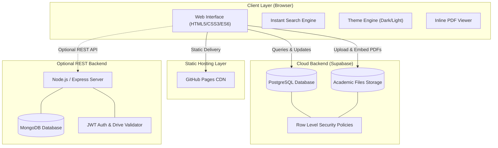
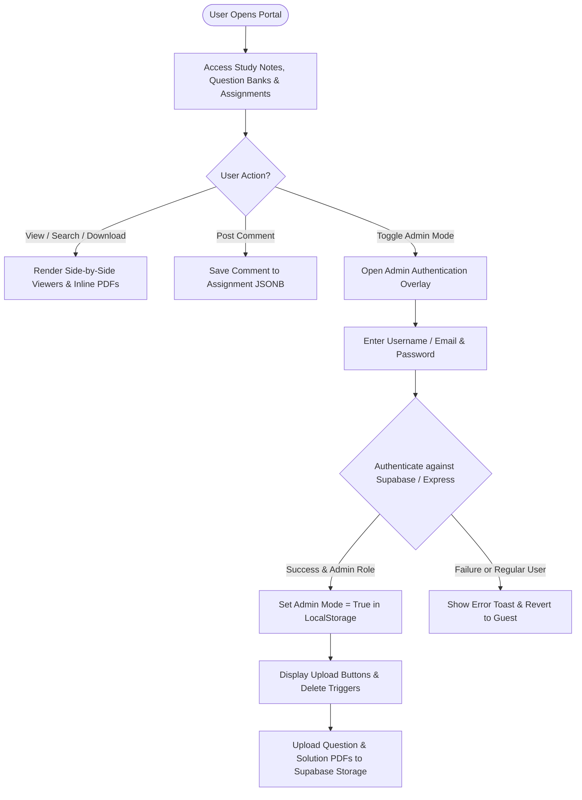
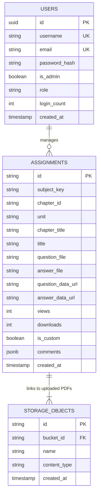

# 🎓 Engineering Notes Hub (NW Portal)

[](https://todkarrohit.github.io/NW/)
[](./SRS_DOCUMENT.md)
[](https://supabase.com)
[](#)
[](#)

> A modern, interactive academic resource portal for engineering students featuring study notes, unit-level question banks, side-by-side assignment model answers, inline PDF rendering, and an admin content management system.

---

## 🌐 Live Portal Access

🚀 Access the live deployed application: **[https://todkarrohit.github.io/NW/](https://todkarrohit.github.io/NW/)**  
📄 View full technical specification: **[Software Requirements Specification (SRS Document)](./SRS_DOCUMENT.md)**

---

## 📐 System Architecture & Visual Diagrams

### 1. High-Level System Architecture
The portal operates on a flexible hybrid architecture with a zero-friction client hosted on GitHub Pages, connected to Supabase serverless database/storage, and an optional modular Node.js/Express REST backend.



---

### 2. User & Admin Authorization Flow
Guest users enjoy 100% unrestricted access to read and download study resources. Admin status is strictly validated prior to allowing content upload, editing, or deletion.



---

### 3. Entity Relationship Diagram (ERD)



---

## 🌟 Accomplishments & Completed Features Matrix

Below is the verified summary of all completed features, UI fixes, and security enhancements in the platform:

| Feature / Fix | Category | Description / Resolution |
| :--- | :--- | :--- |
| **Strict Admin Role Guards** | Security | Content uploads and deletions are strictly guarded by verified `is_admin: true` database roles. |
| **Dual PDF Upload Engine** | Uploads | Upload dual PDFs (Question + Answer) directly to Supabase `academic-files` storage bucket. |
| **Inline PDF Viewer** | PDF Viewing | Ensured files upload with `contentType: application/pdf` to render directly inline in browser frames instead of triggering forced downloads. |
| **Theme Switcher** | UI / UX | Dark & Light mode toggle with persistent preference stored across sessions in `localStorage`. |
| **Interactive Discussion Drawer** | Discussion | Assignment-level comment drawer storing real-time feedback in Supabase JSONB arrays. |
| **Cloud State & Selection Memory** | Persistence | Published items, custom uploads, and active unit selection persist 100% across page reloads/refreshes. |
| **Mobile Drawer & Responsive Grid** | Layout | CSS Grid and Flexbox layout tuned for desktop, tablet, and mobile browsers. |
| **Automated Backend Test Suite** | Testing | Modular Express backend verified with 43 automated unit and integration tests (`test_suite.js`). |

---

## 📖 Subjects Covered

| Subject Code | Full Name | Included Units |
| :--- | :--- | :--- |
| **DSA** | Data Structure & Algorithm (C++) | Unit 1 (DS & Memory), Unit 2 (Sorting & Searching), Unit 3 (Stack), Unit 4 (Queue) |
| **OOP** | Object-Oriented Programming (C++) | Unit 1 (Fundamentals), Unit 2 (Inheritance & Polymorphism), Unit 3 (Exceptions), Unit 4 (File Handling) |
| **OS** | Operating System | Unit 1 (Process Management), Unit 2 (IPC & Deadlocks), Unit 3 (Memory Management), Unit 4 (File Management) |
| **MATH** | Engineering Mathematics | Unit 1 (Logic & Sets), Unit 2 (Relations), Unit 3 (Fourier & Z-Transforms), Unit 4 (Statistics), Unit 5 (Numerical Methods) |
| **COA** | Computer Hardware & Organization | Unit 1 (Data Representation), Unit 2 (Computer Design), Unit 3 (Pipelining), Unit 4 (I/O Organization) |

---

## 🛠️ Tech Stack & Dependencies

- **Frontend**: HTML5, Vanilla CSS3 (Custom Design Tokens, Glassmorphism, CSS Variables), Modern ES6+ JavaScript.
- **Iconography & Fonts**: Font Awesome 6, Google Fonts (`Plus Jakarta Sans`).
- **Cloud Database & Storage**: Supabase PostgreSQL + Supabase S3 Object Storage.
- **Backend (Optional)**: Node.js, Express, MongoDB (Mongoose), JWT (`jsonwebtoken`), `bcryptjs`.
- **Hosting**: GitHub Pages CDN.

---

## 📁 Repository Structure

```
NW/
├── index.html                  # Portal entrance (Redirects to landing page)
├── SRS_DOCUMENT.md             # IEEE Software Requirements Specification
├── README.md                   # Visual project documentation
├── setup_assignments_db.sql    # Supabase PostgreSQL table & RLS policies script
├── setup_storage.sql           # Supabase Storage bucket & policies script
│
├── login/                      # Portal Main Landing Page
│   ├── index.html              # Subject cards, branch filters, search & header
│   └── script.js               # Landing page interactivity & search logic
│
├── notes/                      # Study Notes Module
│   ├── viewer.html             # 2-Panel interactive study notes viewer
│   ├── viewer.css              # Viewer styles
│   └── viewer.js               # Chapter navigator & PDF preview loader
│
├── question_bank/              # Question Bank Module
│   ├── viewer.html             # Unit-wise question bank viewer
│   ├── viewer.css              # Question bank styling
│   └── viewer.js               # Question bank interaction logic
│
├── assignments/                # Assignments Portal
│   ├── assignments.html        # Assignments grid, modal previews & discussion drawer
│   ├── assignments.css         # Assignment layout & modal styling
│   └── assignments.js          # Dual PDF upload, comments & filter logic
│
├── assets/                     # Shared Assets & Libraries
│   ├── auth.js                 # Authentication service & session manager
│   ├── auth-modal.js           # Admin login modal overlay controller
│   ├── data.js                 # Course syllabus & metadata definition
│   └── styles.css              # Core design tokens & global themes
│
└── server/                     # Optional Node.js/Express REST Backend
    ├── server.js               # Express application entry point
    ├── package.json            # Node backend dependencies
    ├── test_suite.js           # Automated test suite (43 test cases)
    ├── config/db.js            # MongoDB connection configuration
    ├── models/                 # Mongoose data schemas (User.js, Resource.js)
    ├── middleware/             # Express middlewares (JWT auth, validation, errors)
    ├── controllers/            # Route handler logic
    └── utils/                  # Google Drive validator & JWT token helpers
```

---

## 🚀 Quick Start & Local Development

### 1. Run Static Frontend Immediately
Simply clone the repository and open `login/index.html` in any browser:
```bash
git clone https://github.com/TodkarRohit/NW.git
cd NW
start login/index.html
```

Or spin up a lightweight local HTTP server:
```bash
npx serve .
```

---

### 2. Optional: Run Modular Node.js / Express Backend
```bash
cd server
npm install
node server.js
```
To run the automated backend test suite (43 tests):
```bash
node test_suite.js
```

---

## 👥 Authors & Contributors

Developed with ❤️ for NMIET Engineering Students:

- **Rohit Todkar** - [GitHub Profile](https://github.com/TodkarRohit)
- **Pratik Shendge**
- **Onkar Pawar** - [GitHub Profile](https://github.com/onkarpawar158-coder)

---

## 📄 License

This project is licensed for academic and educational reference for NMIET Engineering students.
